# cc2image｜zscc配图生成器

一个面向中文内容创作者的 AI 文章视觉生成 Skill。

它不是单一“配图模板”，而是一个「文章理解 + 认知锚点拆图 + 风格库匹配 + 稳定生图提示词 + 批量生图」的视觉系统：可以把中文文章、选题、段落或知识点，自动转成封面图、正文配图、系列主视觉、教程卡片、品牌海报和社媒内容资产。

项目核心是 **cc2image 风格库**：默认使用「手绘知识风」，并内置 43 套可选视觉语言，覆盖知识图解、东方人文、极简编辑、字体材质、微缩场景、商业广告、社会议题和情绪疗愈等方向。用户不指定风格时默认使用 `handdrawn_knowledge_card`；用户说“合适的风格”“帮我选风格”“随机风格”时，会根据内容合理选定风格，而不是纯随机。

## 能做什么
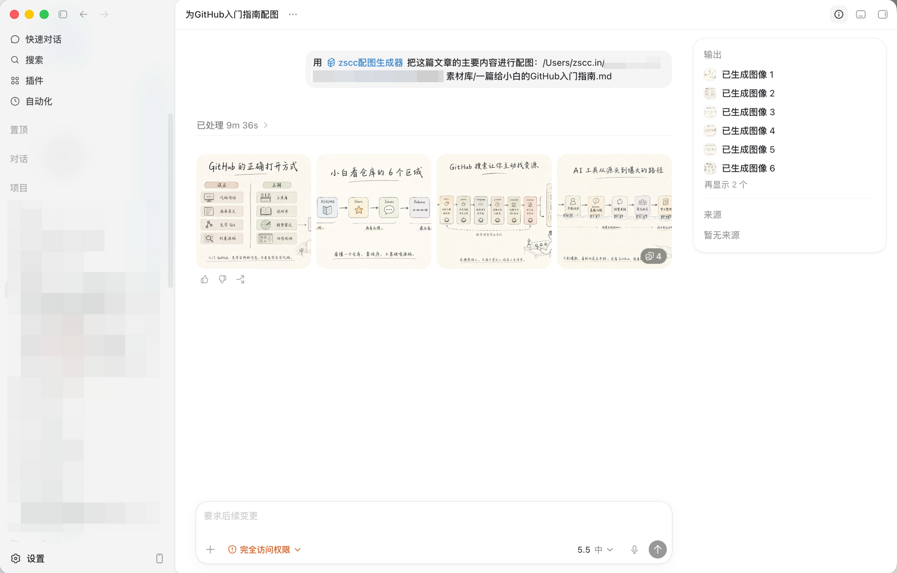
- 把文章拆成「1 张封面 + 多张正文配图」
- 不平均按段落配图，而是优先抓核心判断、认知断点、输入输出、分流、对比、承接路径和常见坑
- 自动判断封面、正文图、系列主视觉、教程页、知识卡片等任务类型
- 根据主题自动匹配 43 套视觉风格
- 生成稳定、可复用的批量生图 JSON / Markdown 清单
- 在可用 `image_gen` 的环境中隐藏提示词并直接批量生图
- 适合小红书、公众号、知识博客、课程内容、品牌专栏和深度文章视觉资产

## 风格效果示例

下面展示已配示例图的 40 套核心风格；第 41 套「轴测模块系统风」、第 42 套「时间微缩风」和第 43 套「实物涂鸦风」为新增方法论风格，可直接使用 `isometric_modular_system`、`isometric_timeline_miniature` 与 `real_object_doodle_composite`。实际生成时会根据用户文章主题、任务类型和指定 `style_id` 自动调整。

<table>
  <tr>
    <td width="50%"><strong>01｜手绘知识风</strong><br><code>handdrawn_knowledge_card</code><br>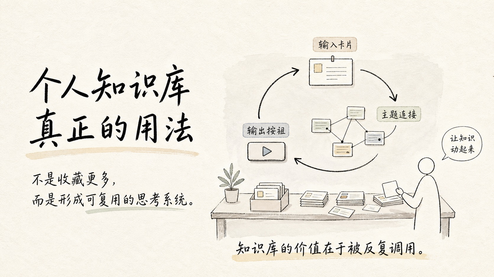</td>
    <td width="50%"><strong>02｜典籍山水风</strong><br><code>oriental_editorial_illustration</code><br>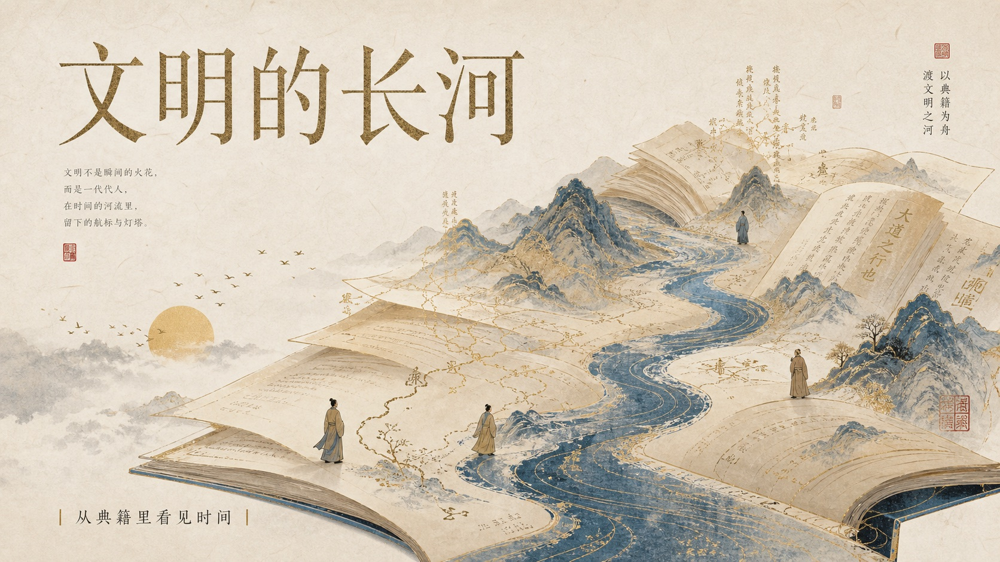</td>
  </tr>
  <tr>
    <td width="50%"><strong>03｜学习笔记风</strong><br><code>study_note_card</code><br>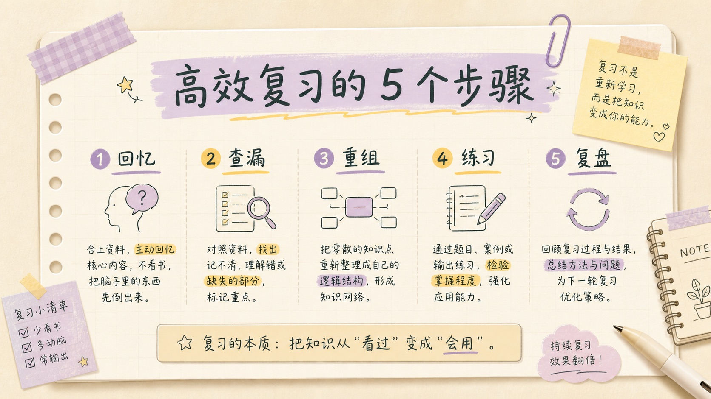</td>
    <td width="50%"><strong>04｜粉彩金字塔风</strong><br><code>pastel_learning_pyramid</code><br>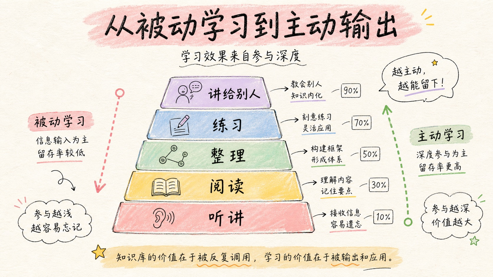</td>
  </tr>
  <tr>
    <td width="50%"><strong>05｜童趣科普风</strong><br><code>childlike_cultural_infographic</code><br>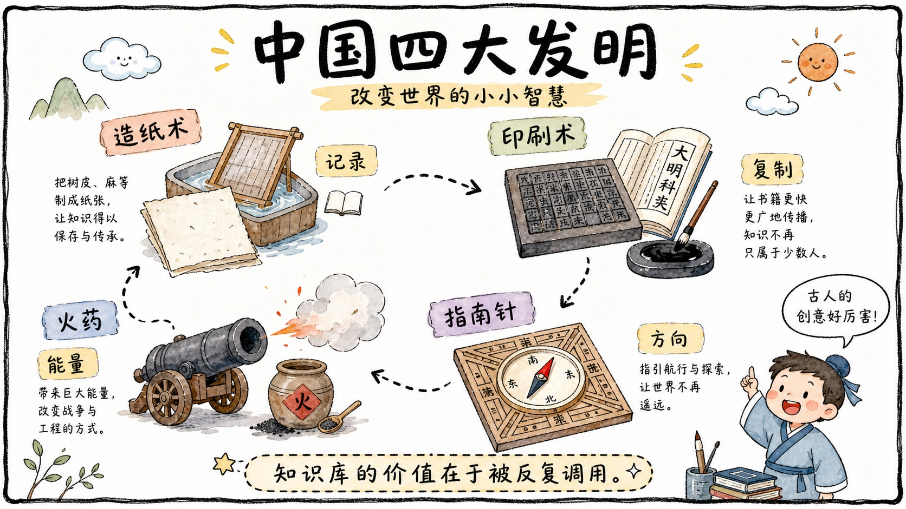</td>
    <td width="50%"><strong>06｜磨砂情绪风</strong><br><code>frosted_glass_editorial</code><br>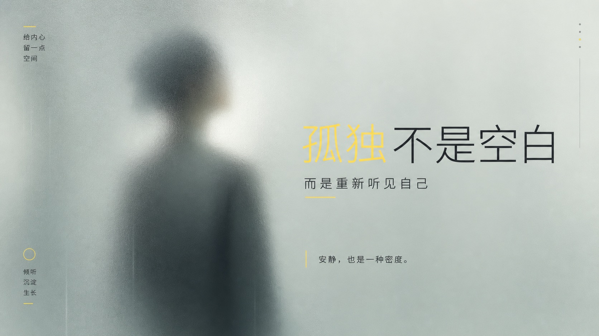</td>
  </tr>
  <tr>
    <td width="50%"><strong>07｜透明物件风</strong><br><code>translucent_object_editorial</code><br>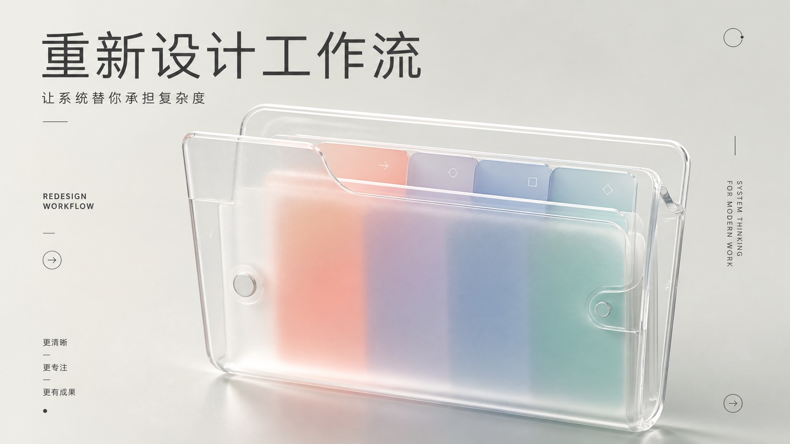</td>
    <td width="50%"><strong>08｜玻璃气泡风</strong><br><code>glassmorphism_gradient_blob</code><br>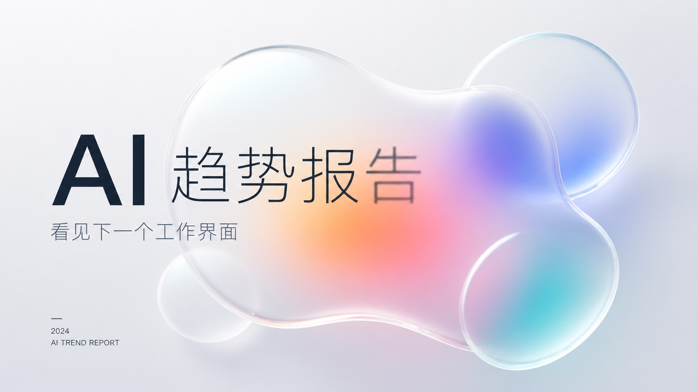</td>
  </tr>
  <tr>
    <td width="50%"><strong>09｜纸雕字体风</strong><br><code>embossed_typography_poster</code><br></td>
    <td width="50%"><strong>10｜亚克力字风</strong><br><code>acrylic_dimensional_type</code><br></td>
  </tr>
  <tr>
    <td width="50%"><strong>11｜霓虹搜索风</strong><br><code>dark_neon_search_ui</code><br>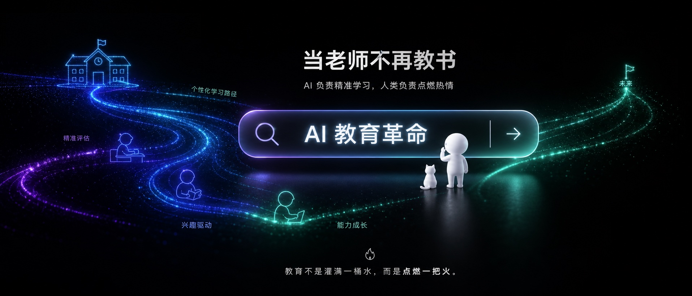</td>
    <td width="50%"><strong>12｜黑场肢体风</strong><br><code>black_void_glowing_hands</code><br></td>
  </tr>
  <tr>
    <td width="50%"><strong>13｜柔光界面风</strong><br><code>soft_neumorphism_ui</code><br>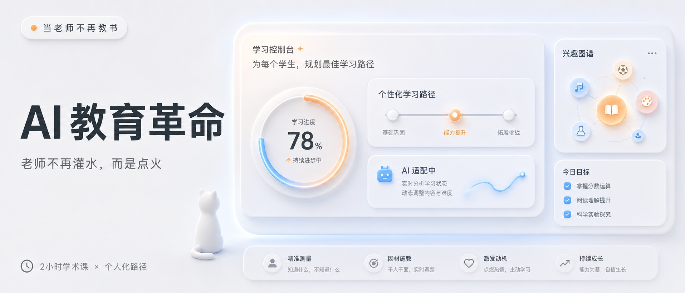</td>
    <td width="50%"><strong>14｜线性品牌风</strong><br><code>minimal_line_shadow_brand</code><br>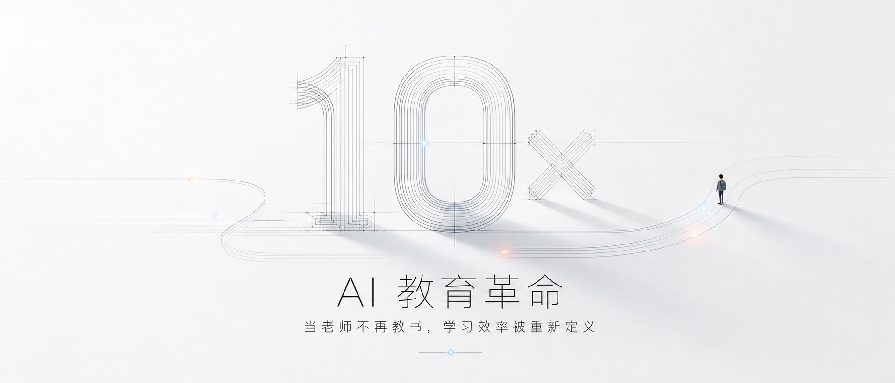</td>
  </tr>
  <tr>
    <td width="50%"><strong>15｜白色肌理风</strong><br><code>white_mono_texture_editorial</code><br>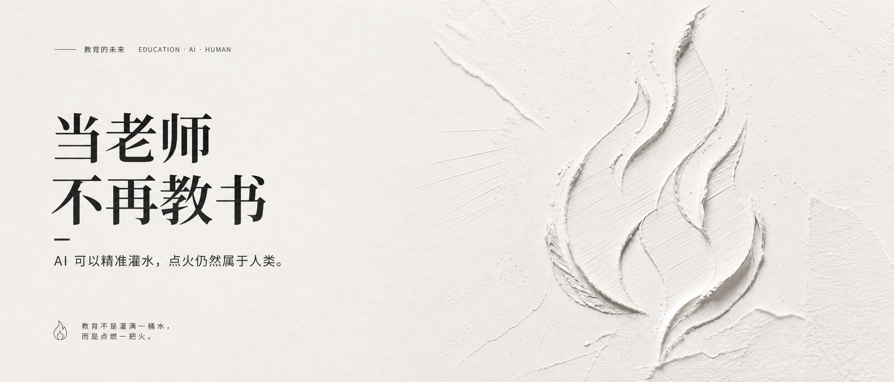</td>
    <td width="50%"><strong>16｜建筑线稿风</strong><br><code>minimal_architecture_portfolio</code><br>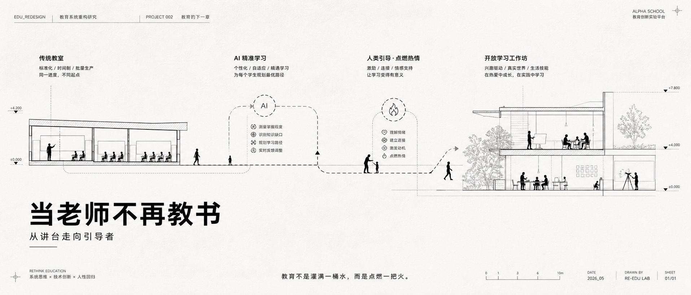</td>
  </tr>
  <tr>
    <td width="50%"><strong>17｜治愈漫画风</strong><br><code>minimal_healing_metaphor_comic</code><br>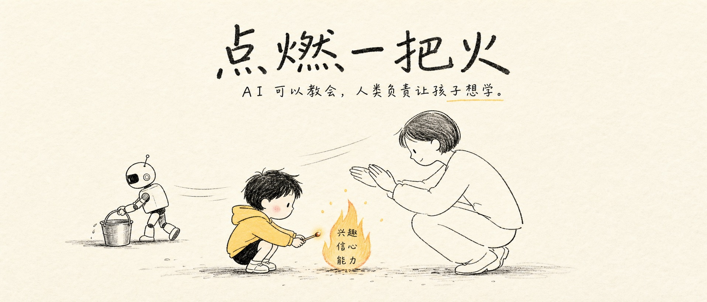</td>
    <td width="50%"><strong>18｜复古海报风</strong><br><code>retro_minimal_poster_illustration</code><br></td>
  </tr>
  <tr>
    <td width="50%"><strong>19｜气球拼贴风</strong><br><code>editorial_balloon_collage</code><br>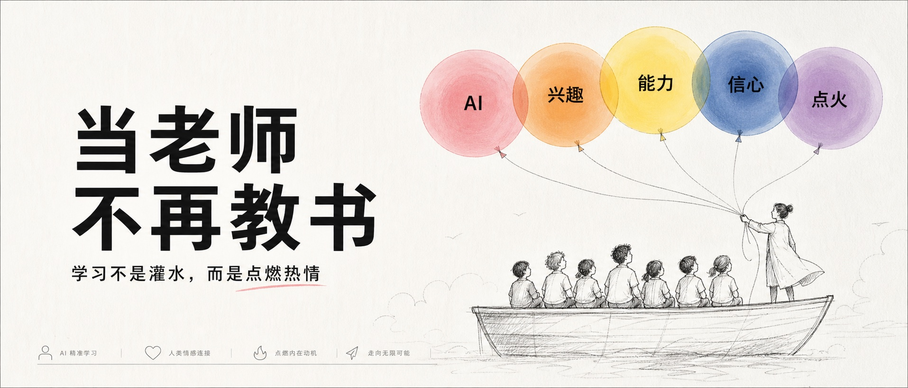</td>
    <td width="50%"><strong>20｜透明字境风</strong><br><code>transparent_architectural_type</code><br>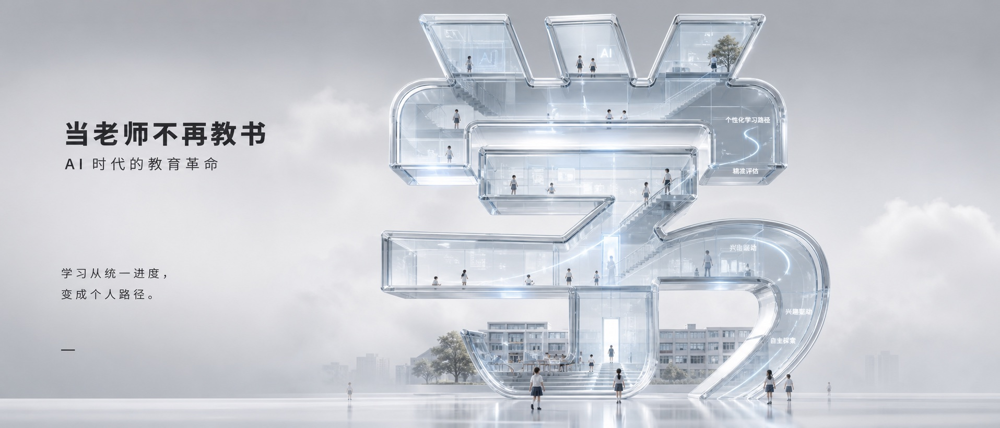</td>
  </tr>
  <tr>
    <td width="50%"><strong>21｜纸雕剪影风</strong><br><code>paper_cut_profile_silhouette</code><br></td>
    <td width="50%"><strong>22｜撕纸便签风</strong><br><code>torn_paper_note_minimal</code><br>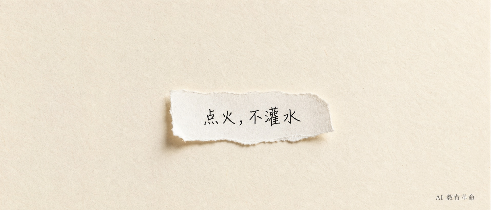</td>
  </tr>
  <tr>
    <td width="50%"><strong>23｜毛绒字体风</strong><br><code>fluffy_soft_typography</code><br>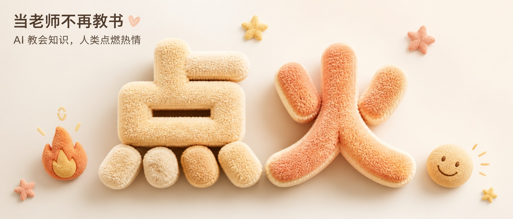</td>
    <td width="50%"><strong>24｜云朵字体风</strong><br><code>cloud_typography_cover</code><br></td>
  </tr>
  <tr>
    <td width="50%"><strong>25｜泡沫字体风</strong><br><code>foam_bubble_typography</code><br>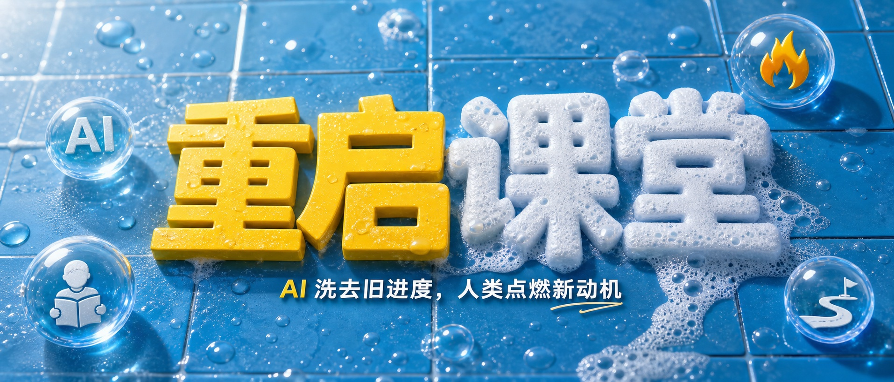</td>
    <td width="50%"><strong>26｜刺绣徽章风</strong><br><code>embroidered_patch_brand</code><br></td>
  </tr>
  <tr>
    <td width="50%"><strong>27｜金属奢华风</strong><br><code>luxury_gold_typography</code><br></td>
    <td width="50%"><strong>28｜微缩地图风</strong><br><code>miniature_map_life_scene</code><br>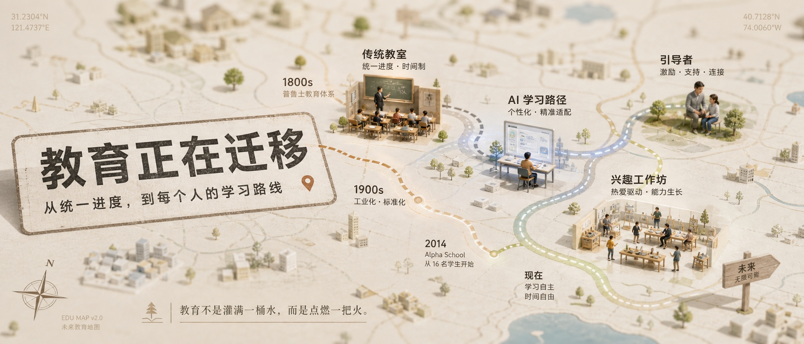</td>
  </tr>
  <tr>
    <td width="50%"><strong>29｜微缩清单风</strong><br><code>miniature_checklist_scene</code><br></td>
    <td width="50%"><strong>30｜布料微缩风</strong><br><code>fabric_micro_scene_ad</code><br>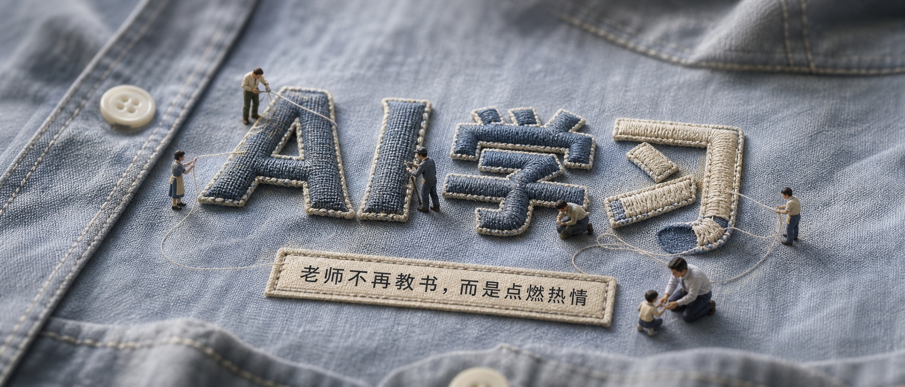</td>
  </tr>
  <tr>
    <td width="50%"><strong>31｜巨字生活风</strong><br><code>giant_letter_lifestyle_scene</code><br>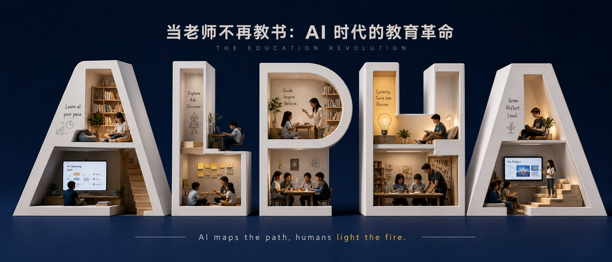</td>
    <td width="50%"><strong>32｜花艺留白风</strong><br><code>oriental_floral_minimal_editorial</code><br></td>
  </tr>
  <tr>
    <td width="50%"><strong>33｜禅意水墨风</strong><br><code>zen_ink_philosophy_poster</code><br></td>
    <td width="50%"><strong>34｜编辑线稿风</strong><br><code>editorial_line_character</code><br>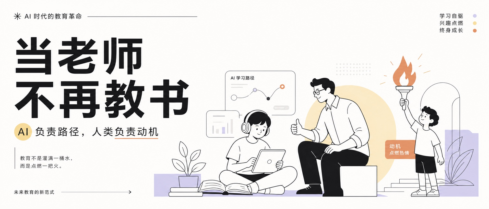</td>
  </tr>
  <tr>
    <td width="50%"><strong>35｜具象标注风</strong><br><code>editorial_object_annotation_card</code><br>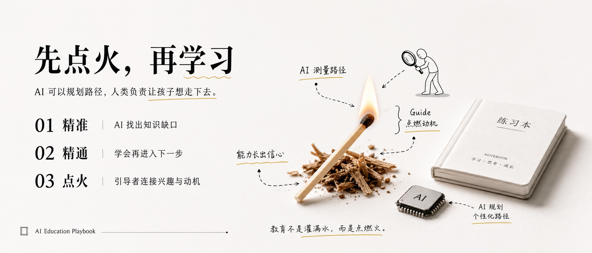</td>
    <td width="50%"><strong>36｜人群造字风</strong><br><code>crowd_typography_scene</code><br>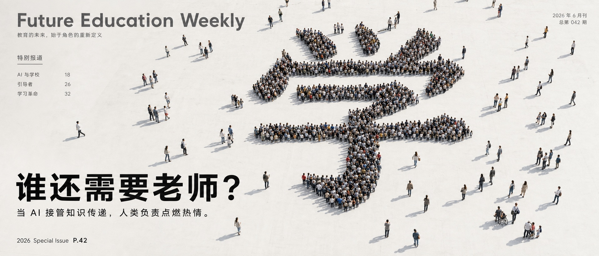</td>
  </tr>
  <tr>
    <td width="50%"><strong>37｜语义字体风</strong><br><code>semantic_material_typography</code><br>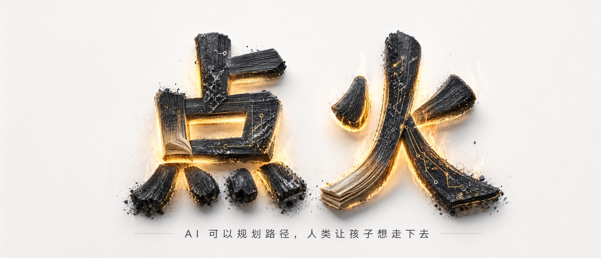</td>
    <td width="50%"><strong>38｜怪诞小人风</strong><br><code>quirky_doodle_character_flow</code><br>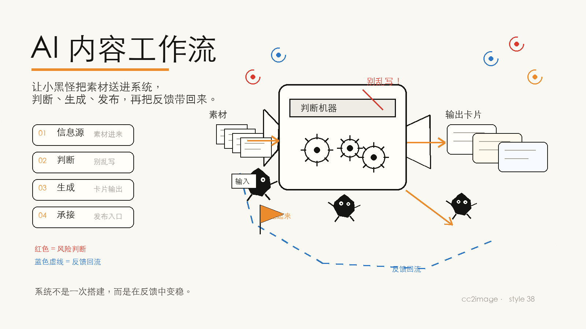</td>
  </tr>
  <tr>
    <td width="50%"><strong>39｜线条艺术风</strong><br><code>minimal_line_art</code><br>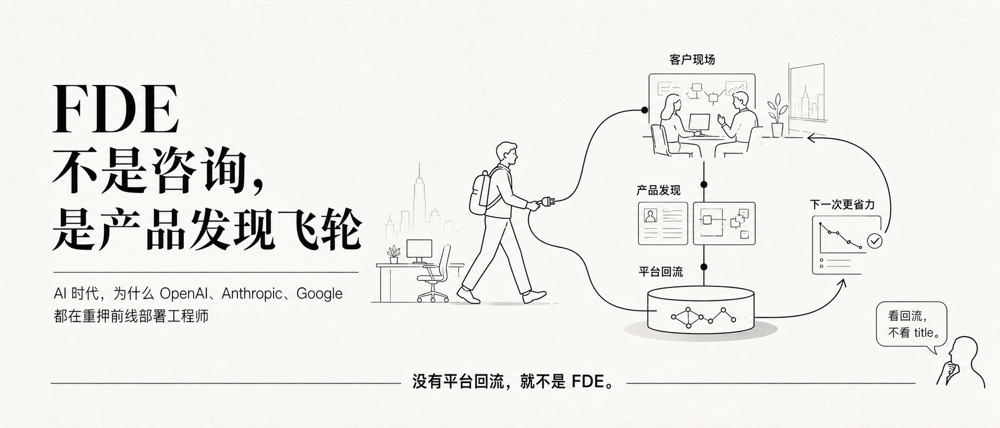</td>
    <td width="50%"><strong>40｜黑白系统风</strong><br><code>monochrome_system_editorial</code><br>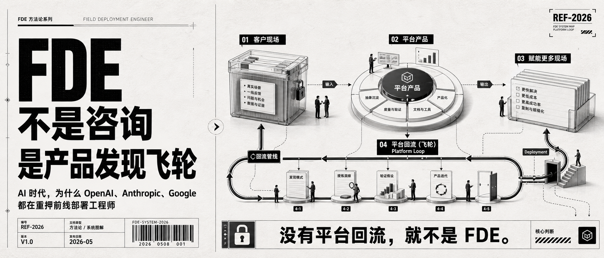</td>
  </tr>
</table>


## 43 套风格

| style_id | 风格名 | 适合场景 |
| --- | --- | --- |
| `handdrawn_knowledge_card` | 手绘知识风 | 默认；正文配图、知识图解、方法论、流程图、对比图 |
| `oriental_editorial_illustration` | 典籍山水风 | 文化、历史、人文、哲学类高级封面 |
| `study_note_card` | 学习笔记风 | 学习方法、笔记整理、步骤教程、知识清单 |
| `pastel_learning_pyramid` | 粉彩金字塔风 | 分层模型、学习金字塔、能力进阶、成长路径 |
| `childlike_cultural_infographic` | 童趣科普风 | 传统文化科普、儿童教育、器物拆解 |
| `frosted_glass_editorial` | 磨砂情绪风 | 心理情绪、孤独感、音乐艺术主题 |
| `translucent_object_editorial` | 透明物件风 | 设计主题、品牌设计、作品集封面、工具系统封面 |
| `glassmorphism_gradient_blob` | 玻璃气泡风 | 品牌视觉、创意展览、趋势报告、AI 主题 |
| `embossed_typography_poster` | 纸雕字体风 | 极简封面、品牌口号、深度思考、书封设计 |
| `acrylic_dimensional_type` | 亚克力字风 | 品牌关键词、栏目标题、创意概念、年轻化封面 |
| `dark_neon_search_ui` | 霓虹搜索风 | AI 搜索、知识探索、信息检索、灵感发现 |
| `black_void_glowing_hands` | 黑场肢体风 | 心理主题、情绪主题、关系连接、孤独感 |
| `soft_neumorphism_ui` | 柔光界面风 | 产品功能封面、AI 工具界面、智能家居、效率工具 |
| `minimal_line_shadow_brand` | 线性品牌风 | 新品发布、品牌封面、科技产品、数字主题 |
| `white_mono_texture_editorial` | 白色肌理风 | 深度文章封面、设计作品集、哲学主题、个人品牌 |
| `minimal_architecture_portfolio` | 建筑线稿风 | 作品集封面、人生路径、职业路径、空间叙事 |
| `minimal_healing_metaphor_comic` | 治愈漫画风 | 情绪疗愈、内耗、孤独、亲密关系、自我照顾 |
| `retro_minimal_poster_illustration` | 复古海报风 | 极简主义、生活方式、个人手册、创作宣言、书封 |
| `editorial_balloon_collage` | 气球拼贴风 | 团队协作、未来愿景、组织文化、品牌广告、社群主题 |
| `transparent_architectural_type` | 透明字境风 | 宏大阶段、未来路径、系统升级、人生转折、空间隐喻 |
| `paper_cut_profile_silhouette` | 纸雕剪影风 | 职业人物、行业精神、工程建筑、人物专访 |
| `torn_paper_note_minimal` | 撕纸便签风 | 一句话封面、信念提醒、极简语录、每日提醒 |
| `fluffy_soft_typography` | 毛绒字体风 | 好运、发财、治愈、可爱、祝福、轻松社媒图 |
| `cloud_typography_cover` | 云朵字体风 | 希望、成长、新开始、复原力、上升、疗愈 |
| `foam_bubble_typography` | 泡沫字体风 | 清洁、焕新、重启、梦想、生活方式海报 |
| `embroidered_patch_brand` | 刺绣徽章风 | 品牌徽章、学院风、社群身份、工具包、服饰品牌 |
| `luxury_gold_typography` | 金属奢华风 | 节日海报、高端品牌、仪式感、成就、庆典 |
| `miniature_map_life_scene` | 微缩地图风 | 人生选择、职业路径、城市迁移、成长路线 |
| `miniature_checklist_scene` | 微缩清单风 | 任务管理、行动清单、习惯养成、目标拆解 |
| `fabric_micro_scene_ad` | 布料微缩风 | 劳动节、匠心、手工、服饰品牌、工艺精神 |
| `giant_letter_lifestyle_scene` | 巨字生活风 | 品牌广告、教育、家庭、城市、组织价值 |
| `oriental_floral_minimal_editorial` | 花艺留白风 | 女性主题、母亲节、思念、关系、疗愈、节气 |
| `zen_ink_philosophy_poster` | 禅意水墨风 | 哲学、人生路径、自我修炼、觉察、东方智慧 |
| `editorial_line_character` | 编辑线稿风 | 品牌视觉、杂志海报、网站首屏、包装、角色系统、城市生活场景 |
| `editorial_object_annotation_card` | 具象标注风 | AI方法论、设计思维、知识卡片、认知模型、信任验证、工作流原则 |
| `crowd_typography_scene` | 人群造字风 | 社会议题、财经封面、就业问题、人口变化、城市议题、商业趋势、群体行为 |
| `semantic_material_typography` | 语义字体风 | 关键词封面、品牌标题、栏目标题、概念海报、单词视觉化、强标题主视觉 |
| `quirky_doodle_character_flow` | 怪诞小人风 | AI工作流、系统流程、正文配图、方法论拆解、工具链说明、长文认知锚点 |
| `minimal_line_art` | 线条艺术风 | 亲密关系、旅行、毕业、学习、课堂、会议、城市、灵感、个人成长、极简封面 |
| `isometric_modular_system` | 轴测模块系统风 | SaaS架构、服务流程、空间地图、系统关系、模块化品牌插画 |
| `monochrome_system_editorial` | 黑白系统风 | Skill封面、SOP封面、提示词库、方法论手册、AI工作流、标准化流程 |
| `isometric_timeline_miniature` | 时间微缩风 | 技术演化、行业发展史、工具变迁、产品迭代、内容生产演化、AI工作流演化、知识管理演化、商业模式演化 |
| `real_object_doodle_composite` | 实物涂鸦风 | 幽默封面、创意配图、社媒传播图、情绪表达、工作压力、学习压力、心理状态、视觉双关、正文配图 |


## 默认匹配规则

如果用户没有指定风格：

1. 普通知识/正文配图：默认 `handdrawn_knowledge_card`。
2. 用户说“合适的风格”“帮我选风格”“随机风格”：根据内容合理选择。
3. 文化、历史、人文、哲学、东方智慧：优先 `oriental_editorial_illustration`。
4. 学习方法、笔记、复习、考试：优先 `study_note_card`。
5. 学习金字塔、层级模型、能力进阶：优先 `pastel_learning_pyramid`。
6. 儿童教育、传统文化科普、器物拆解：优先 `childlike_cultural_infographic`。
7. 孤独、情绪、心理、艺术展：优先 `frosted_glass_editorial` 或 `black_void_glowing_hands`。
8. 设计、品牌、作品集、工具系统：优先 `translucent_object_editorial`。
9. AI、未来感、趋势、品牌视觉：优先 `glassmorphism_gradient_blob`。
10. 深度思考、极简口号、书封：优先 `embossed_typography_poster` 或 `white_mono_texture_editorial`。
11. AI 搜索、探索、检索、推荐：优先 `dark_neon_search_ui`。
12. 产品界面、搜索框、控制器、智能家居：优先 `soft_neumorphism_ui`。
13. 新品发布、数字主题、极简科技：优先 `minimal_line_shadow_brand`。
14. 作品集、路径规划、空间叙事：优先 `minimal_architecture_portfolio`。
15. 情绪疗愈、内耗、孤独、亲密关系、自我照顾、被爱、好运、鼓励、生活感悟、内在小孩：优先 `minimal_healing_metaphor_comic`。
16. 极简主义、生活方式、个人手册、创作宣言、书封：优先 `retro_minimal_poster_illustration`。
17. 团队协作、共同成长、组织文化、未来愿景、品牌广告：优先 `editorial_balloon_collage`。
18. 宏大阶段、未来路径、系统升级、人生转折、空间隐喻：优先 `transparent_architectural_type`。
19. 职业人物、行业精神、工程建筑、创始人故事、人物专访：优先 `paper_cut_profile_silhouette`。
20. 信念提醒、每日一句、极简语录、心理暗示、单个关键词：优先 `torn_paper_note_minimal`。
21. 好运、发财、治愈、可爱、祝福、轻松社媒图：优先 `fluffy_soft_typography`。
22. 希望、成长、新开始、复原力、上升、疗愈：优先 `cloud_typography_cover`。
23. 清洁、焕新、重启、生活刷新：优先 `foam_bubble_typography`。
24. 品牌徽章、社群身份、学院风、服饰、工具包：优先 `embroidered_patch_brand`。
25. 高端、奢华、节日、仪式感、庆典、成就、财富：优先 `luxury_gold_typography`。
26. 人生路径、职业选择、城市迁移、过去与现在、成长路线：优先 `miniature_map_life_scene`。
27. 任务清单、执行力、打卡、习惯养成、目标拆解：优先 `miniature_checklist_scene`。
28. 匠心、劳动节、手工、服饰、工艺、细节：优先 `fabric_micro_scene_ad`。
29. 品牌名、组织价值、教育场景、家庭场景、字母空间：优先 `giant_letter_lifestyle_scene`。
30. 女性、母亲节、思念、关系、疗愈、花艺、节气：优先 `oriental_floral_minimal_editorial`。
31. 哲学、人生道路、修行、自律、克己、觉察、禅意、格言：优先 `zen_ink_philosophy_poster`。
32. 黑白线稿、编辑插画、品牌视觉系统、角色 set、城市生活、杂志版式、包装、网站首屏、App 概念：优先 `editorial_line_character`。
33. AI 方法论、设计原则、信任、验证、判断力、工作流原则、创作者手册、playbook、三条原则、用一个物品隐喻一个观点：优先 `editorial_object_annotation_card`。
34. 社会议题、就业、人口、城市、群体行为、商业趋势、用户规模、公共政策、平台经济、组织协作，或需要很多真实小人组成符号、文字、数字或图形：优先 `crowd_typography_scene`。
35. 突出标题文字本身、关键词视觉化、品牌字、栏目名、短句封面、材质字体、醒目主视觉，或希望根据内容自动设计字体质感：优先 `semantic_material_typography`。
36. AI 工作流、系统流程、工具链、Prompt 结构、自动化步骤、内容生产系统、从混乱到输出、卡住到跑起来，或希望用轻松怪诞的小人表现复杂流程：优先 `quirky_doodle_character_flow`。
37. 极简表达人物、关系、旅行、毕业、学习、课堂、会议、城市、灵感、孤独、陪伴、个人成长，或希望用少量线条抽象表达一个概念：优先 `minimal_line_art`。
38. Skill、SOP、提示词库、方法论、系统搭建、标准化、知识资产、流程封装、AI 工作流、路由判断、商业路径、出海增长，或需要黑白高对比、巨型文字、专业系统封面：优先 `monochrome_system_editorial`。
39. 发展史、演化、变迁、从 A 到 B、过去到现在、技术迭代、行业阶段、工具演进、产品版本、时间线讲解：优先 `isometric_timeline_miniature`。
40. 幽默创意配图、视觉双关、真实物品与手绘角色结合、压力、疲惫、焦虑、卡住、情绪隐喻、日常物品变成画面关键部分：优先 `real_object_doodle_composite`。

> 多数封面型风格更适合头图 / 海报 / 系列主视觉；正文解释图仍建议默认使用手绘知识风。若用户要“安慰人、表达情绪、做治愈图”，优先使用治愈漫画风；若用户要字体材质类封面，可在亚克力字风、纸雕字体风、透明字境风、毛绒字体风、云朵字体风、泡沫字体风、金属奢华风、语义字体风中选择；流程解释优先使用怪诞小人风；专业系统封面、SOP 和提示词库优先使用黑白系统风。


## 可视化研究所方法论增强

本仓库新增 `references/kashika_method.md`，把可視化研究所《CORPORATE PROFILE / 「絵本」案内 ver.》中的插画方法论整理为 cc2image 可执行规则：

- 先做语言整理：关键词抽取、要约、目标读者重写，再进入画面。
- 按目标受众控制信息密度、变形程度、亲和感和信任感。
- 把单张插画升级为可长期复用的品牌资产：角色、图标、版式、VI 规则和系列一致性。
- 将视觉输出分成 Infographic、Storyboard、Mapping、Main Visual、Cut Illust、Guide Character、Pictogram、VI Guideline 八类，便于按任务选择表达方式。

这会让 cc2image 不只“生成好看的配图”，而是更稳定地把复杂内容转译成可理解、可记忆、可复用的视觉系统。


## 轴测模块系统风增强

本仓库新增 `references/kashika_isometric_method.md`，把 Kashika-Lab 关于アイソメトリック図法的思路转成 cc2image 可执行规则，并新增第 41 套风格 `isometric_modular_system`（轴测模块系统风）：

- 先定义信息任务：路径、结构、流程、空间、层级或数据关系。
- 先定统一轴测/等距网格，再画元素，避免近大远小和强透视。
- 用顶面、左面、右面分别承载路径、结构、标签等信息。
- 把平台、方块、楼层、路径、管道、人物、信息卡片沉淀成可复用组件。
- 特别适合 SaaS 架构、AI Agent 系统、服务流程、空间地图、产品功能总览和品牌官网插画。

## 时间微缩风增强

本仓库新增第 42 套风格 `isometric_timeline_miniature`（时间微缩风）：

- 用 45° 等距俯视视角，把主题演化做成横向微型 3D 时间轴展台。
- 底座从左到右分成 4-6 个时代区域，每段放置代表物件、工具、设备、环境或技术。
- 每段加入 1-3 个微型人物互动，形成“微型历史博物馆 / 桌面沙盘 / 教育展览模型”的叙事感。
- 特别适合技术演化、行业发展史、工具变迁、产品迭代、AI 工作流演化、知识管理演化和商业模式演化。


## 实物涂鸦风增强

本仓库新增第 43 套风格 `real_object_doodle_composite`（实物涂鸦风）：

- 用一个真实日常物品作为画面关键语义，而不是装饰。
- 用黑色手绘线稿角色补完故事，让真实物品变成头、头发、大脑、身体、负担、心脏、道具或爆炸。
- 通过“真实物品 + 手绘角色 + 语义错位”制造幽默、聪明、易传播的视觉双关。
- 特别适合情绪表达、工作压力、学习压力、创作者状态、轻量观点、社媒封面和正文配图。


## 可视化研究所进阶方法增强

本仓库新增 `references/kashika_advanced_methods.md`，继续吸收 Kashika-Lab 官网文章中的方法：

- 解释度滑杆：图解型、夸张型、场景型、世界观型，按用途控制“准确解释”和“印象表达”的比例。
- 7 轴评估：品牌调性、目标读者、复用性、记忆符号、独有信息、趣味钩子、可访问性/安全性。
- 数据动作映射：把变量映射为角色姿态、动作幅度、状态面板，让读者先观察再追溯机制。
- 漫画共感型信息图：把问卷题目转成主人公场景，把比例转成共感率，适合用户洞察和趋势报告。
- 角色解像度：为 guide character 补齐性格、口头禅、动作范围和禁用设定，让系列图更稳定。
- 可分解交付：把一张图拆成角色、图标、路径、标签和背景模块，服务长期内容运营。

## 长文拆图方法

cc2image 在做文章配图时会先出一份 shot list：每张图对应一个认知锚点，而不是平均给每段配一张图。常见锚点包括核心判断、认知断点、输入输出闭环、分流判断、前后对比、承接路径、常见坑和角色状态变化。

38 号「怪诞小人风」已针对长文正文配图做专项增强：版式不固定，先找核心动作和隐喻，再让“小黑”参与流程、卡点、分拣、承接或回流本身，保证角色不是装饰。

参考与致谢：38 号风格的长文拆图方法参考并适配了 [helloianneo/ian-xiaohei-illustrations](https://github.com/helloianneo/ian-xiaohei-illustrations) 的开源思路（MIT）。

## 安装

推荐安装到本地 Skills 目录：

```bash
git clone https://github.com/izscc/cc2image.git ~/.agents/skills/zscc配图生成器
```

## 使用示例

```text
使用 $zscc配图生成器，帮我把这篇文章拆成 1 张封面 + 5 张正文配图，并直接批量生图。
```

```text
用合适的风格，帮我给这篇文章做一张封面。
```

```text
用霓虹搜索风，做一张 AI 搜索产品封面。
```

```text
用黑场肢体风，做一张关于孤独和连接的封面。
```

```text
用柔光界面风，做一张效率工具功能封面。
```

```text
用治愈漫画风，做一张关于“给自己充电”的小红书治愈图。
```

```text
用云朵字体风，做一张关于“重新开始”的励志封面。
```

```text
用泡沫字体风，做一张关于“重启生活”的品牌海报。
```

```text
用禅意水墨风，做一张关于“自律与修行”的哲学封面。
```

```text
用编辑线稿风，做一张品牌视觉系统海报，主题是“城市里的高效工作流”。
```

```text
用具象标注风，做一张关于“别急着生成，先验证”的 AI 方法论卡片。
```

```text
用人群造字风，做一张关于“AI 时代的职业迁移”的深度报道封面。
```

```text
用语义字体风，把“根基”做成长期主义主题的材质字体封面。
```

```text
用怪诞小人风，画一张“AI 内容工作流”的流程封面。
```

```text
用线条艺术风，做一张关于“人生要留白”的极简封面。
```

```text
用黑白系统风，做一张“Skill 封装”的方法论封面。
```

```text
用时间微缩风，做一张“AI 内容生产演化”的中文信息图封面。
```

```text
用实物涂鸦风，做一张“工作压力像石头压在身上”的幽默封面。
```

## 文件结构

```text
.
├── SKILL.md
├── agents/
│   └── openai.yaml
├── references/
│   ├── article_breakdown.md
│   ├── body_prompt.md
│   ├── cover_prompt.md
│   ├── style_options.md
│   └── visual_style.md
└── scripts/
    └── prompt_schema.py
```

## 辅助脚本

`scripts/prompt_schema.py` 可用于把结构化字段渲染成批量生图 JSON。

自测：

```bash
python3 scripts/prompt_schema.py --self-test
```

## 许可证

MIT License
